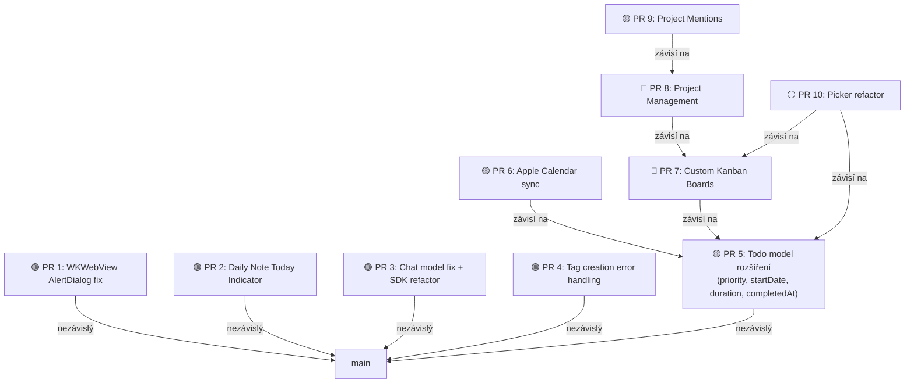
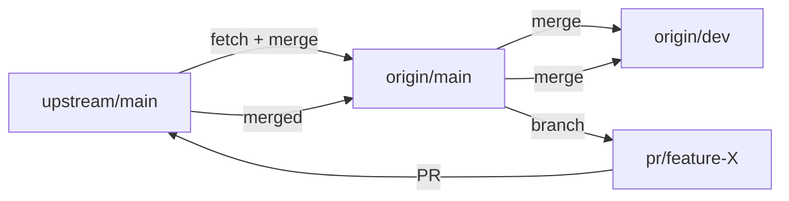

# Strategie: Extrakce features z `dev` do samostatných PR

## Kontext

- `main` = upstream (`firstloophq/nomendex`)
- `dev` = tvoje osobní větev s 43 commity navíc
- Cíl: vytvořit **čisté, izolované PR** pro každou feature, aby upstream mohl reviewovat a přijmout jednotlivě

---

## Mapa závislostí



> **Legenda**: 🟢 snadné izolovat, 🟡 středně složité, 🔴 složité / provázané, ⚪ refactor

---

## Doporučené pořadí PR

### Tier 1 — Nezávislé opravy (cherry-pick přímo)

Tyto commity se dotýkají pouze svých vlastních souborů a nemají žádné závislosti.

---

#### PR 1: WKWebView AlertDialog fix

| | |
|---|---|
| **Účel** | Nahrazení `confirm()` vlastními dialogy pro WKWebView kompatibilitu |
| **Commity** | `e374a7e` |
| **Dotčené soubory** | `alert-dialog.tsx`, `NotesFileTree.tsx`, `notes/browser-view.tsx` |
| **Riziko konfliktu** | Nízké |

```bash
git checkout main
git checkout -b pr/wkwebview-alert-dialog
git cherry-pick e374a7e
# review, test, push
git push origin pr/wkwebview-alert-dialog
```

---

#### PR 2: Daily Note Today Indicator

| | |
|---|---|
| **Účel** | Zvýraznění dnešního dne v date pickeru denních poznámek |
| **Commity** | `1b41dbe` |
| **Dotčené soubory** | `daily-note-date-picker-dialog.tsx`, `output.css` |
| **Riziko konfliktu** | Nízké |

```bash
git checkout main
git checkout -b pr/daily-note-today-indicator
git cherry-pick 1b41dbe
git push origin pr/daily-note-today-indicator
```

---

#### PR 3: Chat model fix

| | |
|---|---|
| **Účel** | Odstranění hardcoded neplatného modelu z chat routes |
| **Commity** | `b788152`, `36a0640` |
| **Dotčené soubory** | `chat-routes.ts` (jen 1 soubor) |
| **Riziko konfliktu** | Nízké |

```bash
git checkout main
git checkout -b pr/fix-chat-model
git cherry-pick b788152 36a0640
git push origin pr/fix-chat-model
```

---

#### PR 4: Tag creation error handling

| | |
|---|---|
| **Účel** | Lepší parsování chybových zpráv a HTTP kódy pro vytváření tagů |
| **Commity** | `8cba06c` (nebo `7c23c78` — jsou téměř identické, vyber jeden) |
| **Dotčené soubory** | `useNotesAPI.ts`, `notes-routes.ts`, `server.ts` |
| **Riziko konfliktu** | Nízké |

```bash
git checkout main
git checkout -b pr/tag-error-handling
git cherry-pick 8cba06c
git push origin pr/tag-error-handling
```

---

### Tier 2 — Středně složité features

Vyžadují pečlivější přípravu, ale stále izolované.

---

#### PR 5: Todo model rozšíření (priority, startDate, duration, completedAt)

> [!IMPORTANT]
> Toto je **základní stavební kámen** pro další PR (Calendar sync, Kanban boards). Doporučuji odeslat jako první z větších features.

| | |
|---|---|
| **Účel** | Přidání `priority`, `startDate`, `duration`, `completedAt` polí na todo |
| **Klíčové commity** | `bf0c12e`, `ce90005`, `792c0cd`, `35f53b7` |
| **Dotčené soubory** | `todo-types.ts`, `fx.ts`, `browser-view.tsx`, `TodoCard.tsx`, `PriorityFilter.tsx` (NEW), `useTodosAPI.ts`, `todos-routes.ts` |
| **Riziko konfliktu** | Střední — `browser-view.tsx` je dotčen i kanban commity |

**Postup** — cherry-pick nebude čistý, protože `browser-view.tsx` obsahuje i kanban změny. Doporučuji:

```bash
git checkout main
git checkout -b pr/todo-scheduling-priority

# Cherry-pick se může vyžádat --no-commit + manuální úpravy
git cherry-pick --no-commit bf0c12e   # model fields
git cherry-pick --no-commit ce90005   # scheduling UI
git cherry-pick --no-commit 792c0cd   # clearing date fields API
git cherry-pick --no-commit 35f53b7   # disable default alarms

# Manuálně vyřešit konflikty v browser-view.tsx
# Odstranit části specifické pro kanban, nechat jen scheduling
git add .
git commit -m "feat: add priority, startDate, duration fields to todo model with scheduling UI"
git push origin pr/todo-scheduling-priority
```

---

#### PR 6: Apple Calendar Integration

| | |
|---|---|
| **Účel** | Nativní sync úkolů s Apple Calendar přes EventKit |
| **Závisí na** | PR 5 (priority fields) |
| **Commity** | `f98830e` |
| **Dotčené soubory** | `CalendarManager.swift` (NEW), `calendar-bridge.ts` (NEW), `WebViewWindowController.swift`, `Info.plist`, `entitlements.plist`, build scripts |
| **Riziko konfliktu** | Nízké (většinou nové soubory) |

> [!WARNING]
> Tato feature je velmi specifická pro macOS. Upstream ji nemusí přijmout pokud aplikace cílí i na jiné platformy. Zvažte diskuzi v issue předem.

```bash
# Po mergi PR 5
git checkout main  # (s mergenutým PR 5)
git checkout -b pr/apple-calendar-sync
git cherry-pick f98830e
git push origin pr/apple-calendar-sync
```

---

### Tier 3 — Komplexní features (vyžadují novou branch + manuální práci)

---

#### PR 7: Custom Kanban Boards

> [!CAUTION]
> Toto je **nejsložitější feature** k extrakci. Dotýká se mnoha souborů a je propojena s Project Management. Doporučuji odeslat jako "standalone" verzi bez project-specifických boardů.

| | |
|---|---|
| **Účel** | Vlastní sloupce na Kanban nástěnce |
| **Závisí na** | PR 5 (kvůli `customColumnId` na modelu) |
| **Klíčové commity** | `3f90bd4`, `20af3f6`, `322ecc6`, `c7fb7eb`, `c4d9558`, `da47fce`, `01010ad`, `505e9cb`, `2238ba4`, `959bddb` |
| **Dotčené soubory** | `board-types.ts` (NEW), `BoardSettingsDialog.tsx` (NEW), `browser-view.tsx`, `fx.ts`, `ProjectBrowserView.tsx`, `projects-routes.ts`, `FileDatabase.ts`, `onStartup.ts`, `server.ts` |

**Postup** — cherry-pick nepůjde čistě. Doporučuji **interaktivní rebase na novou branch**:

```bash
git checkout main
git checkout -b pr/custom-kanban-boards

# Cherry-pick hlavní commity chronologicky
git cherry-pick --no-commit 3f90bd4   # základní implementace
git cherry-pick --no-commit 20af3f6   # auto-move cards
git cherry-pick --no-commit 322ecc6   # fix column deletions
git cherry-pick --no-commit c7fb7eb   # translate comments
git cherry-pick --no-commit c4d9558   # per-project boards
git cherry-pick --no-commit da47fce   # delete column API
git cherry-pick --no-commit 01010ad   # drag & drop reordering
# ... vyřešit konflikty manuálně

# Squashnout do logických commitů
git commit -m "feat: implement custom Kanban board columns with drag-and-drop"
git push origin pr/custom-kanban-boards
```

---

#### PR 8: Project Management

| | |
|---|---|
| **Závisí na** | PR 7 (Kanban boards se váží na projekty) |
| **Commity** | `b74df5c`, `1a95dc8`, `d755c6e`, `28e125c`, `0f201e2` |
| **Nové soubory** | `projects-types.ts`, `projects-service.ts`, `projects-migration.ts` |

---

#### PR 9: Project Mentions

| | |
|---|---|
| **Závisí na** | PR 8 (projekty musí existovat) |
| **Commit** | `30773f9` |
| **Dotčené soubory** | `FilePickerDialog.tsx` (1 soubor) |

Po mergi PR 8 je to jednoduchý cherry-pick.

---

### Tier 4 — Refactoring (doporučuji odeslat až po přijetí base features)

#### PR 10: Picker components extraction

| | |
|---|---|
| **Závisí na** | PR 5 + PR 7 (pickery obsahují priority + kanban logiku) |
| **Commity** | `4891654`, `c806205` |
| **Nové soubory** | 7 picker komponent |

---

## Souhrnná tabulka

| # | PR | Obtížnost | Závislost | Upstream šance |
|---|---|---|---|---|
| 1 | WKWebView AlertDialog | 🟢 Snadný | Žádná | ⭐⭐⭐⭐⭐ |
| 2 | Daily Note Today Indicator | 🟢 Snadný | Žádná | ⭐⭐⭐⭐⭐ |
| 3 | Chat model fix | 🟢 Snadný | Žádná | ⭐⭐⭐⭐⭐ |
| 4 | Tag error handling | 🟢 Snadný | Žádná | ⭐⭐⭐⭐⭐ |
| 5 | Todo scheduling & priority | 🟡 Střední | Žádná | ⭐⭐⭐⭐ |
| 6 | Apple Calendar sync | 🟡 Střední | PR 5 | ⭐⭐ (macOS only) |
| 7 | Custom Kanban Boards | 🔴 Složitý | PR 5 | ⭐⭐⭐ |
| 8 | Project Management | 🔴 Složitý | PR 7 | ⭐⭐⭐ |
| 9 | Project Mentions | 🟢 Snadný | PR 8 | ⭐⭐⭐⭐ |
| 10 | Picker refactor | 🟡 Střední | PR 5+7 | ⭐⭐⭐⭐ |

---

## Commity které NE-odesílat upstream

Tyto commity jsou specifické pro tvůj fork a nemají smysl jako PR:

| Commit | Popis | Důvod |
|---|---|---|
| `f6422c5`, `88672ac`, `55de0a5`, `79c1a58` | `git.md`, `.gitignore` pro lokální docs | Osobní workflow dokumentace |
| `18fe827` | Smazání feedback dokumentu | Lokální soubor |
| `1588ee3` | `docs/features/*` | Dokumentace tvých features (pošli s příslušným PR) |
| `fc38461` | Překlad českých příkladů v skills | Obsaženo v rámci kanban PR |
| `0592cd4` | Duplicát `3969b61` | Duplicitní commit |

---

## Doporučený workflow pro budoucí práci



1. **Před začátkem nové feature**: vždy `git fetch upstream && git merge upstream/main` do `main`
2. **Branch pro PR**: vždy vytvářej z aktuálního `main`, ne z `dev`
3. **Vývoj na dev**: merge feature branch do `dev` pro osobní testování
4. **Po přijetí PR**: merge aktualizovaný `main` zpět do `dev`

---

## Verifikace

Protože tento plán **nepíše žádný kód** a pracuje pouze s gitem, verifikace spočívá v:

1. **Kontrola izolace**: po cherry-pick na branch z `main` ověřit, že build funguje (`npm run build` / `bun run build`)
2. **Kontrola diff**: `git diff main..pr/feature-X --stat` by měl ukazovat jen soubory relevantní pro danou feature
3. **Manuální test**: spustit aplikaci z PR branch a ověřit, že feature funguje izolovaně
